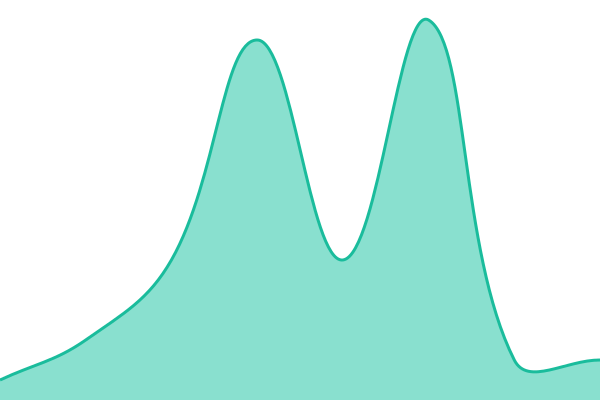

# [📈 Live Status](https://demo.upptime.js.org): <!--live status--> **🟩 All systems operational**

This repository contains the open-source uptime monitor and status page for [JaeHyeop Lee](https://juno.my/), powered by [Upptime](https://github.com/upptime/upptime).

With [Upptime](https://upptime.js.org), you can get your own unlimited and free uptime monitor and status page, powered entirely by a GitHub repository. We use [Issues](https://github.com/dragonjuno/ovn-uptime/issues) as incident reports, [Actions](https://github.com/dragonjuno/ovn-uptime/actions) as uptime monitors, and [Pages](https://demo.upptime.js.org) for the status page.

<!--start: status pages-->
<!-- This summary is generated by Upptime (https://github.com/upptime/upptime) -->
<!-- Do not edit this manually, your changes will be overwritten -->
<!-- prettier-ignore -->
| URL | Status | History | Response Time | Uptime |
| --- | ------ | ------- | ------------- | ------ |
|  [오븐 웹사이트](https://artovn.com) | 🟩 Up | [오븐-웹사이트.yml](https://github.com/dragonjuno/ovn-uptime/commits/HEAD/history/오븐-웹사이트.yml) | 

 844ms
     
 | 

<a href="https://status.ovn.one/history/오븐-웹사이트">100.00%</a>
    

|  [오븐 지원센터](https://artovn.com) | 🟩 Up | [오븐-지원센터.yml](https://github.com/dragonjuno/ovn-uptime/commits/HEAD/history/오븐-지원센터.yml) | 

 721ms
     
 | 

<a href="https://status.ovn.one/history/오븐-지원센터">100.00%</a>
    

|  [오븐 이미지 서버](https://cdn.ovn.one) | 🟩 Up | [오븐-이미지-서버.yml](https://github.com/dragonjuno/ovn-uptime/commits/HEAD/history/오븐-이미지-서버.yml) | 

 219ms
     
 | 

<a href="https://status.ovn.one/history/오븐-이미지-서버">100.00%</a>
    

|  [오븐 알림 서버](wss.ovn.one) | 🟩 Up | [오븐-알림-서버.yml](https://github.com/dragonjuno/ovn-uptime/commits/HEAD/history/오븐-알림-서버.yml) | 

 10ms
     
 | 

<a href="https://status.ovn.one/history/오븐-알림-서버">100.00%</a>
    

<!--end: status pages-->

[**Visit our status website →**](https://demo.upptime.js.org)

## 📄 License

- Powered by: [Upptime](https://github.com/upptime/upptime)
- Code: [MIT](./LICENSE) © [Anand Chowdhary](https://anandchowdhary.com)
- Data in the `./history` directory: [Open Database License](https://opendatacommons.org/licenses/odbl/1-0/)
